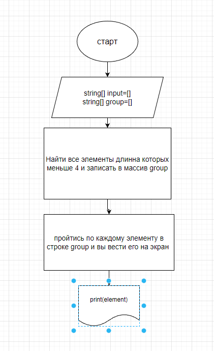

## Здесь будет размещена картинка блок-схемы по решению итоговой задачи

# В начале, чтоб решить задачу максимально емко,  хотела найти метод, что позволил бы мне взять одтн элемент массива и ииз него сделать отдельный массив.
# тогда для решения мне бы надо было:
1 создать и наполнить массив

2 найти метод, который бы правильным образом заполнил бы второй массив первым элементом 1-го массива

3 сравнить меньше ли длина 2-го массива 3 и если да, то вывести его на экран

4 Обнулить 2-й массив, заполнить его следующим жлементом 1-го массива и вернуться к пункту 3, повторять до тех пор, пока не дойдем до конца 1- го массива

# однако в поисках решения я нашла прекрасный метод _Array.FindAll()_ , который находит все элементы в массиве, подходящие под заданное описане. И тогда мое решение превратилось в:
1 Создать и наполнить массив

2 найти в этом массиве все элементы, длинна которых менее 4 (то есть от 0 до 3 включительно)
3 занести это в массив "group" 
4 пройтись по всему массиву "group" и вывести все его элементы

# Вроде по пунктам это одинаково, но в коде это в два раза меньше строк! Надеюсь вам мое решение понравится))
